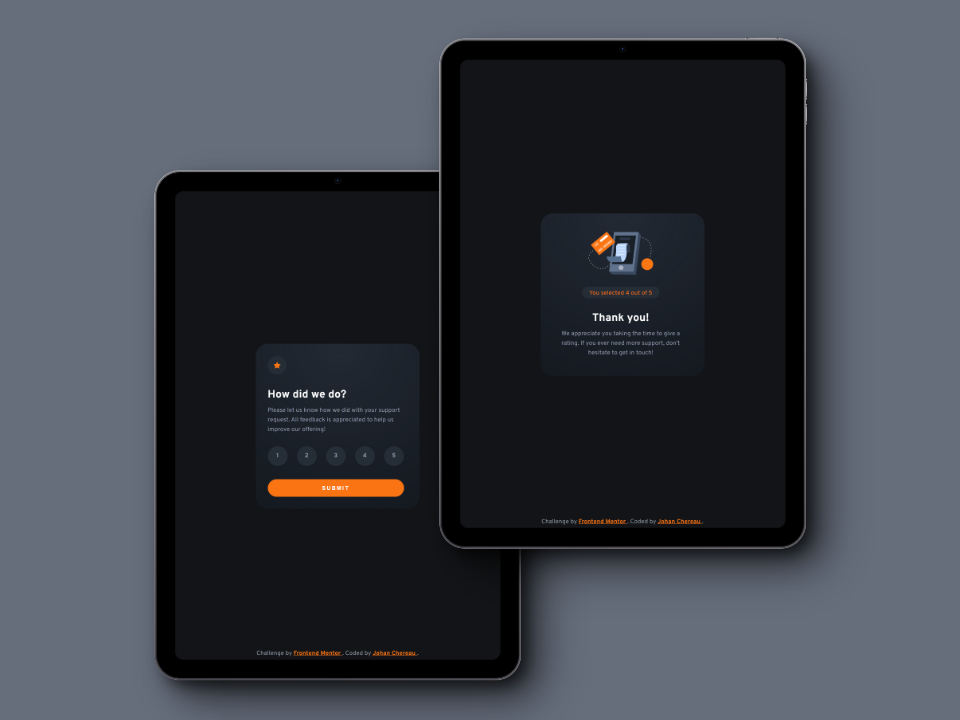

# Frontend Mentor - Interactive rating component solution

This is a solution to the [Interactive rating component challenge on Frontend Mentor](https://www.frontendmentor.io/challenges/interactive-rating-component-koxpeBUmI). Frontend Mentor challenges help you improve your coding skills by building realistic projects. 

## Table of contents

- [Overview](#overview)
  - [The challenge](#the-challenge)
  - [Design](#design)
  - [Screenshots](#screenshots)
  - [Links](#links)
- [My process](#my-process)
  - [Built with](#built-with)
  - [What I learned](#what-i-learned)
  - [Useful resources](#useful-resources)
- [Author](#author)
- [Acknowledgments](#acknowledgments)

## Overview

### The challenge

Users should be able to:

- View the optimal layout for the app depending on their device's screen size
- See hover states for all interactive elements on the page
- Select and submit a number rating
- See the "Thank you" card state after submitting a rating

### Design

#### Design to integrate


### Screenshots

#### Mobile view


#### Tablet view



#### Laptop view


### Links

- Solution on Front End Mentor: [Click here]()
- Live Site URL: [Click here]()


## My process

### Built with

- Semantic HTML5 markup
- CSS custom properties
- Flexbox
- CSS Grid
- Mobile-first workflow
- BEM (Block, Element, Modifier)
- JavaScript

### What I learned

- I have discovered the CSS value `fit-content` to ensure that the size adapts to the content :

```css
  width: fit-content;
```

- A quick reminder about the form's radio buttons.

### Useful resources

- [MDN - fit-content](https://developer.mozilla.org/en-US/docs/Web/CSS/fit-content) - MDN Documentation on fit-content.
- [MDN - radio button](https://developer.mozilla.org/en-US/docs/Web/HTML/Element/input/radio) - MDN Documentation on radio buttons.

## Author

- Frontend Mentor - [@JohanChereau](https://www.frontendmentor.io/profile/JohanChereau)
